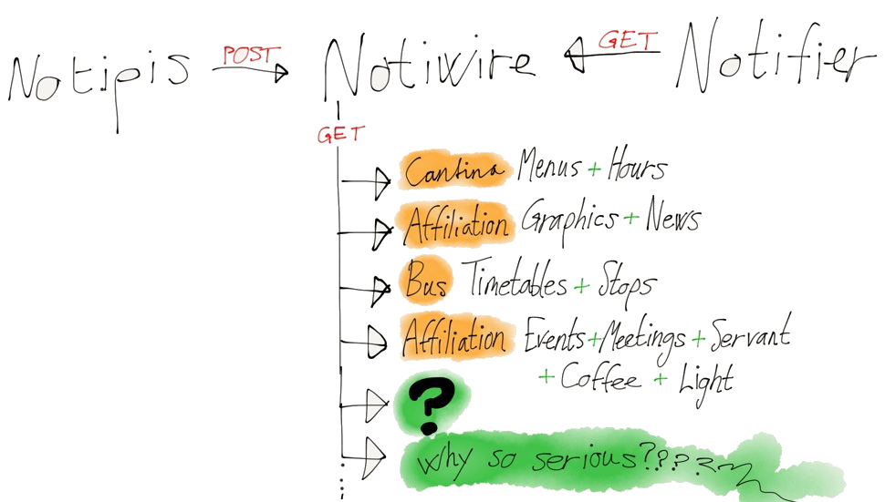

Notiwire
========
Notiwire works as a proxy/middlelayer for Notifiers and as an endpoint for
NotiPis.

This project tries to solve three central problems:

1. **aggregator**: take the load off various websites which today has to serve a lot
of content to an increasingly big number of Notifiers (clients).

2. **parser**: websites which distributes data in unfriendly formats (html, text etc.)
has to be parsed and presented in json. As of today this is done on the clientside (Notifier).
This is considered to be an unnecessary and heavy task for a browser extension.

3. **listener**: each NotiPi reports back to Notiwire over http. It is Notiwire's job
job to handle incoming data. Examples will follow.

### API
Due to the nature of appKom we hope that Notiwire can serve useful data to
anyone who wants to develop apps, websites or scripts. Documentation will follow.

### References
[Notiwire (Python)](https://github.com/appKom/notiwire/commits/master)
by [@michaeljohansen], [@cXhristian] & [@lizter].

[@michaeljohansen]: http://github.com/michaeljohansen "Michael Johansen"
[@cXhristian]: http://github.com/cXhristian "Christian Duvholt"
[@lizter]: http://github.com/lizter "Christian Strand Young"
